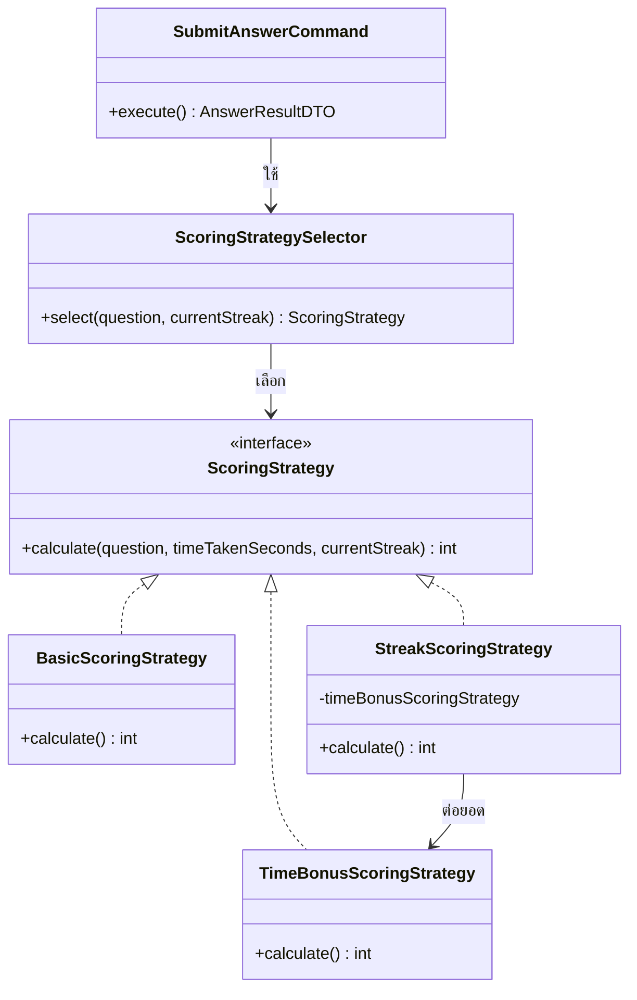
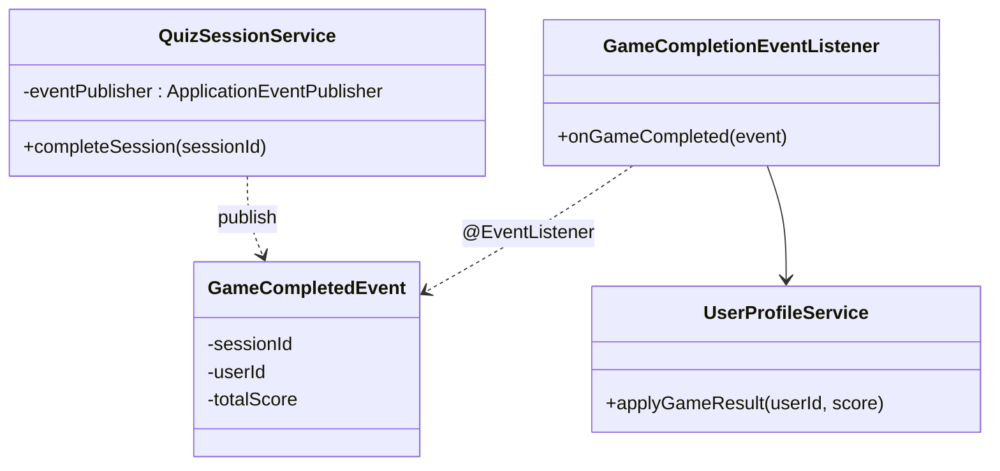
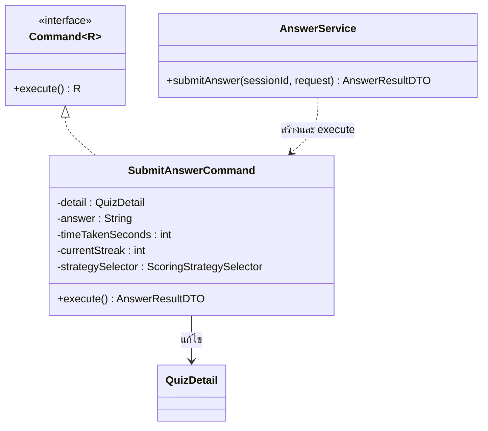

# Design Patterns

เลือก GoF กลุ่ม **Behavioral** 3 แบบ (Strategy, Observer, Command) เพราะปัญหาหลักของเกมคือพฤติกรรมที่เปลี่ยนตามสถานการณ์ (สูตรคะแนน), การแจ้งผลข้ามส่วน (จบเกมแล้วต้องอัปเดตโปรไฟล์) และการห่อ action ที่มีหลายขั้นตอน (ตอบคำถาม) ส่วน Factory เป็นส่วนเสริมสำหรับการสร้างชุดคำถาม

## สรุป

| Pattern | กลุ่ม | ปัญหาที่แก้ | ไฟล์ / คลาส | ผู้รับผิดชอบ |
|---|---|---|---|---|
| Strategy | Behavioral | สูตรคิดคะแนนหลายแบบ เพิ่มแบบใหม่ได้โดยไม่แก้โค้ดเดิม | `service/scoring/ScoringStrategy`, `BasicScoringStrategy`, `TimeBonusScoringStrategy`, `StreakScoringStrategy`, `ScoringStrategySelector` | thanakit |
| Observer | Behavioral | จบเกมแล้วต้องอัปเดตโปรไฟล์ โดยไม่ให้ QuizSessionService ผูกกับ UserProfileService | `event/GameCompletedEvent`, `event/GameCompletionEventListener`, `service/QuizSessionService`, `service/UserProfileService` | pheerapat |
| Command | Behavioral | การตอบคำถาม 1 ข้อมีหลายขั้นตอนและต้องกันตอบซ้ำ | `service/command/Command`, `service/command/SubmitAnswerCommand`, `service/AnswerService` | kongpob |
| Factory | Creational (เสริม) | สุ่มชุดคำถามตามหมวดหมู่และจำนวน | `service/QuestionFactory` | rattaphum |

Enterprise patterns ที่ใช้ทั้งโปรเจกต์: Layered Architecture, MVC (Thymeleaf controller/web + REST), Repository (Spring Data JPA), Service Layer, DTO (แยก entity ออกจาก API), Dependency Injection แบบ constructor ผ่าน `@RequiredArgsConstructor`

---

## 1. Strategy — การคิดคะแนน

**ปัญหา:** คะแนนต่อข้อขึ้นกับหลายเงื่อนไข ถ้าเขียนเป็น if-else ก้อนเดียวใน service จะแก้ยากและทดสอบแยกไม่ได้ และทีมอาจเพิ่มสูตรใหม่ (เช่น คะแนนตามความยาก) ภายหลัง

**โครงสร้าง**

**การทำงาน**

| สูตร | เงื่อนไขที่ถูกเลือก | คะแนน |
|---|---|---|
| `BasicScoringStrategy` | คำถามไม่มีเวลาจำกัด | 10 |
| `TimeBonusScoringStrategy` | streak < 2 | 10 + 10 × เวลาที่เหลือ ÷ เวลาทั้งหมด |
| `StreakScoringStrategy` | streak ≥ 2 | TimeBonus × (1 + 10% × min(streak, 5)) |

`ScoringStrategySelector` เป็น context ที่เลือก strategy ส่วน `SubmitAnswerCommand` เรียกผ่าน interface เท่านั้น ไม่รู้ว่าเป็นสูตรไหน

**เพิ่มสูตรใหม่:** สร้าง class ใหม่ implement `ScoringStrategy` แล้วเพิ่มเงื่อนไขใน selector ไม่ต้องแก้ command หรือ service อื่น (Open/Closed)

**เทส:** `ScoringStrategyTest` ทดสอบแต่ละสูตรแยกกันโดยไม่ต้องมี Spring หรือฐานข้อมูล

---

## 2. Observer — อัปเดตโปรไฟล์เมื่อจบเกม

**ปัญหา:** เมื่อรอบการเล่นจบ ต้องอัปเดตคะแนนรวม เลเวล และ streak ในโปรไฟล์ ถ้าให้ `QuizSessionService` เรียก `UserProfileService` ตรง ๆ ส่วนเกมจะผูกกับส่วนโปรไฟล์ และในอนาคตถ้ามีสิ่งที่ต้องทำเพิ่มตอนจบเกม (เช่น แจก badge, อัปเดตห้องแข่ง) ต้องแก้ `QuizSessionService` ทุกครั้ง

**โครงสร้าง**

**การทำงาน:** `completeSession` รวมคะแนนแล้วเรียก `eventPublisher.publishEvent(new GameCompletedEvent(...))` จบหน้าที่ของตัวเอง `GameCompletionEventListener` รับ event ด้วย `@EventListener` แล้วส่งต่อให้ `UserProfileService.applyGameResult` ทำงานใน transaction เดียวกัน ถ้าอัปเดตโปรไฟล์ล้มเหลว การจบเกมจะ rollback ด้วย

**เพิ่ม observer ใหม่:** สร้าง class ใหม่ที่มี `@EventListener` รับ `GameCompletedEvent` ไม่ต้องแก้ `QuizSessionService`

**เทส:** `QuizSessionServiceTest` ตรวจว่ามีการ publish event พร้อมค่าถูกต้อง ส่วน `UserProfileServiceTest` ตรวจผลของ event (เลเวล, streak) แยกกัน

---

## 3. Command — การส่งคำตอบ

**ปัญหา:** การตอบคำถาม 1 ข้อประกอบด้วย ตรวจว่ายังไม่เคยตอบ ตรวจถูกผิด เลือกสูตรและคิดคะแนน บันทึกคำตอบ เวลา และคะแนนลง `QuizDetail` แล้วคืนผล ถ้าเขียนรวมใน service จะเทสยากเพราะต้อง mock repository และ Spring ทั้งหมด

**โครงสร้าง**

**การทำงาน:** `AnswerService` (invoker) โหลด `QuizDetail` ตรวจสถานะ session หา streak ของผู้เล่น แล้วสร้าง `SubmitAnswerCommand` พร้อมข้อมูลครบ เรียก `execute()` ครั้งเดียว command แก้ไข `QuizDetail` และคืน `AnswerResultDTO` จากนั้น service บันทึก

**ประโยชน์ที่ได้จริง:** `SubmitAnswerCommandTest` ทดสอบตรรกะตอบถูก/ผิด/ตอบซ้ำ ได้ด้วย object ธรรมดา ไม่ต้องมี Spring หรือฐานข้อมูล และในอนาคตเก็บ command ไว้ทำ audit log หรือ replay ได้

---

## 4. Factory — สุ่มชุดคำถาม (เสริม)

`QuestionFactory.createQuizQuestions(categoryId, count)` ห่อการสุ่มคำถามจากฐานข้อมูล (`ORDER BY RANDOM()` + limit) และโยน `QuestionNotFoundException` เมื่อหมวดไม่มีคำถาม ใช้ทั้งใน `QuizSessionService` (เล่นคนเดียว) และ `RoomService` (สุ่ม 1 ชุดแล้วแจกให้ทุกคนในห้อง) จุดเดียวที่ต้องแก้ถ้าเปลี่ยนวิธีเลือกคำถาม เช่น เลือกตามความยาก

---

## ที่ไม่ได้ใช้และเหตุผล

- **State pattern** สำหรับสถานะ session/room: สถานะมีแค่ 3 ค่าและการเปลี่ยนสถานะอยู่ในเมธอดเดียว ใช้ enum กับการตรวจเงื่อนไขพอ ถ้าทำเป็น State class จะเพิ่มไฟล์โดยไม่ลดความซับซ้อน
- **Decorator** สำหรับสูตรคะแนน: `StreakScoringStrategy` ต่อยอดจาก `TimeBonusScoringStrategy` ซึ่งใกล้เคียง Decorator แต่ไม่ได้ทำให้ซ้อนกันได้อิสระ จึงนับเป็น Strategy ที่ compose กัน
