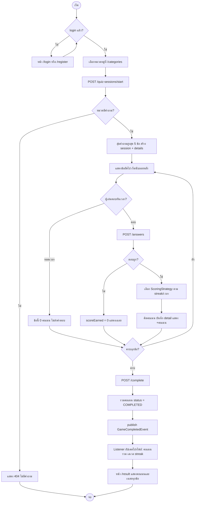
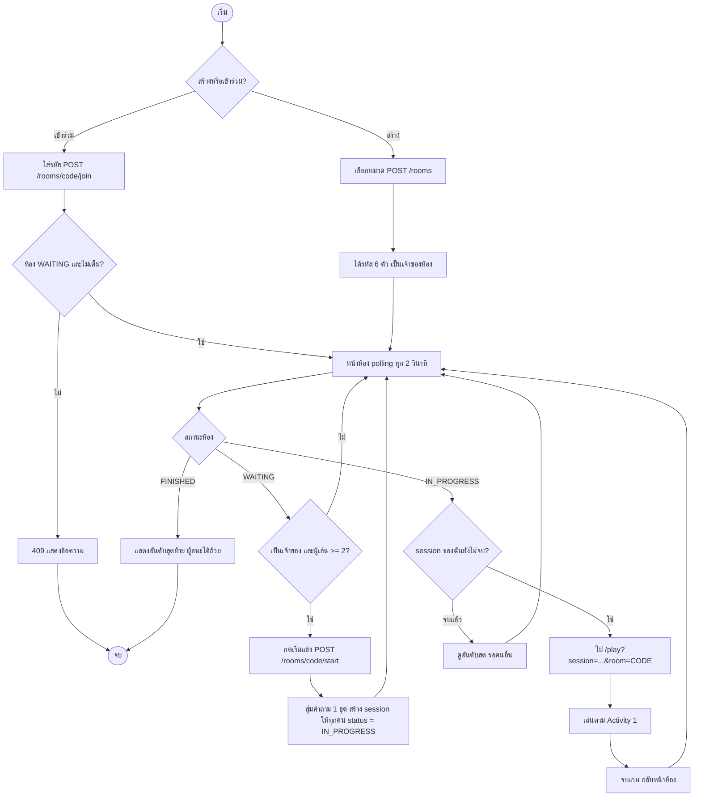
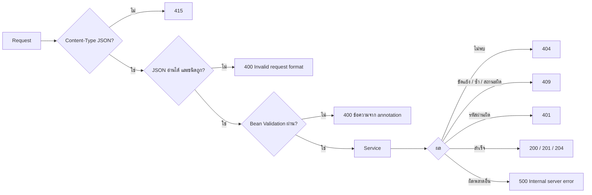

# Activity Diagram

## 1. เล่นเกม 1 รอบ (คนเดียว)

```mermaid
flowchart TD
    A([เริ่ม]) --> B{login แล้ว?}
    B -- ไม่ --> B1[หน้า /login หรือ /register] --> B
    B -- ใช่ --> C[เลือกหมวดหมู่ที่ /categories]
    C --> D[POST /quiz-sessions/start]
    D --> D1{หมวดมีคำถาม?}
    D1 -- ไม่ --> D2[แสดง 404 ไม่มีคำถาม] --> Z
    D1 -- ใช่ --> E[สุ่มคำถามสูงสุด 5 ข้อ สร้าง session + details]
    E --> F[แสดงข้อถัดไป เริ่มนับถอยหลัง]
    F --> G{ผู้เล่นตอบทันเวลา?}
    G -- หมดเวลา --> H[ข้อนี้ 0 คะแนน ไม่ส่งคำตอบ]
    G -- ตอบ --> I[POST /answers]
    I --> J{ตอบถูก?}
    J -- ไม่ --> K[scoreEarned = 0 แสดงเฉลย]
    J -- ใช่ --> L[เลือก ScoringStrategy ตาม streak/เวลา]
    L --> M[คิดคะแนน บันทึก detail แสดง +คะแนน]
    H --> N{ครบทุกข้อ?}
    K --> N
    M --> N
    N -- ยัง --> F
    N -- ครบ --> O[POST /complete]
    O --> P[รวมคะแนน status = COMPLETED]
    P --> Q[publish GameCompletedEvent]
    Q --> R[Listener อัปเดตโปรไฟล์: คะแนนรวม เลเวล streak]
    R --> S[หน้า /result แสดงคะแนนและเฉลยทุกข้อ]
    S --> Z([จบ])
```

## 2. แข่งในห้อง (หลายคน)

```mermaid
flowchart TD
    A([เริ่ม]) --> B{สร้างหรือเข้าร่วม?}
    B -- สร้าง --> C[เลือกหมวด POST /rooms] --> D[ได้รหัส 6 ตัว เป็นเจ้าของห้อง]
    B -- เข้าร่วม --> E[ใส่รหัส POST /rooms/code/join]
    E --> E1{ห้อง WAITING และไม่เต็ม?}
    E1 -- ไม่ --> E2[409 แสดงข้อความ] --> Z
    E1 -- ใช่ --> F
    D --> F[หน้าห้อง polling ทุก 2 วินาที]
    F --> G{สถานะห้อง}
    G -- WAITING --> H{เป็นเจ้าของ และผู้เล่น >= 2?}
    H -- ใช่ --> I[กดเริ่มแข่ง POST /rooms/code/start]
    H -- ไม่ --> F
    I --> J[สุ่มคำถาม 1 ชุด สร้าง session ให้ทุกคน status = IN_PROGRESS]
    J --> F
    G -- IN_PROGRESS --> K{session ของฉันยังไม่จบ?}
    K -- ใช่ --> L[ไป /play?session=...&room=CODE]
    L --> M[เล่นตาม Activity 1]
    M --> N[จบเกม กลับหน้าห้อง]
    N --> F
    K -- จบแล้ว --> O[ดูอันดับสด รอคนอื่น]
    O --> F
    G -- FINISHED --> P[แสดงอันดับสุดท้าย ผู้ชนะได้ถ้วย]
    P --> Z([จบ])
```

## 3. การตรวจสอบ request ของ API (ทุก endpoint)

```mermaid
flowchart LR
    A[Request] --> B{Content-Type JSON?}
    B -- ไม่ --> B1[415]
    B -- ใช่ --> C{JSON อ่านได้ และชนิดถูก?}
    C -- ไม่ --> C1[400 Invalid request format]
    C -- ใช่ --> D{Bean Validation ผ่าน?}
    D -- ไม่ --> D1[400 ข้อความจาก annotation]
    D -- ใช่ --> E[Service]
    E --> F{ผล}
    F -- ไม่พบ --> F1[404]
    F -- ขัดแย้ง / ซ้ำ / สถานะผิด --> F2[409]
    F -- รหัสผ่านผิด --> F3[401]
    F -- สำเร็จ --> F4[200 / 201 / 204]
    F -- ผิดพลาดอื่น --> F5[500 Internal server error]
```
