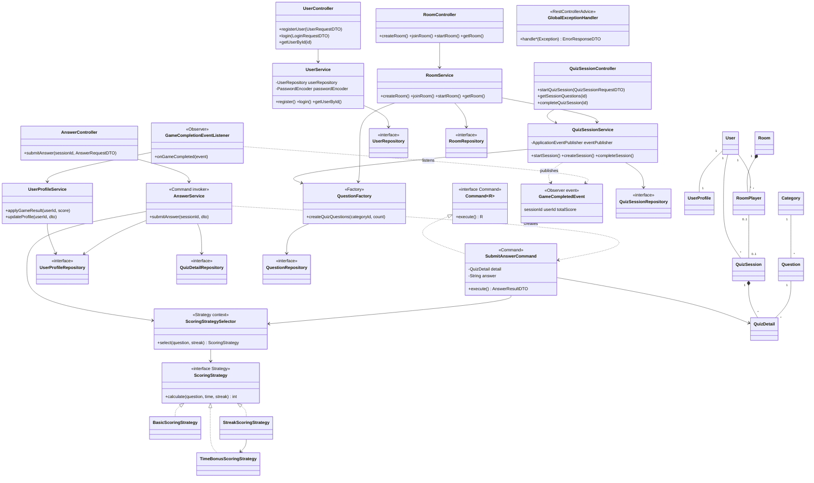

# Class Diagram

แสดงคลาสหลักแยกตาม layer และตำแหน่งของ Design Pattern (กล่องที่มี «pattern» ในชื่อ) ละ DTO และ getter/setter เพื่อให้อ่านได้

## ตำแหน่ง Design Pattern

| Pattern | คลาส | บทบาท |
|---|---|---|
| Strategy | `ScoringStrategy` | interface กลยุทธ์ |
| | `BasicScoringStrategy`, `TimeBonusScoringStrategy`, `StreakScoringStrategy` | concrete strategy |
| | `ScoringStrategySelector` | context เลือกกลยุทธ์ตาม streak และเวลาจำกัด |
| Command | `Command<R>` | interface คำสั่ง |
| | `SubmitAnswerCommand` | concrete command ห่อการตอบคำถาม 1 ข้อ |
| | `AnswerService` | invoker สร้างและสั่ง execute |
| | `QuizDetail` | receiver ที่ถูกแก้ไข |
| Observer | `GameCompletedEvent` | เหตุการณ์ |
| | `QuizSessionService` | subject ที่ publish ผ่าน `ApplicationEventPublisher` |
| | `GameCompletionEventListener` | observer ที่รับและส่งต่อให้ `UserProfileService` |
| Factory | `QuestionFactory` | สร้างชุดคำถามให้ `QuizSessionService` และ `RoomService` |

คลาสที่ไม่ได้วาด: `CategoryService`, `QuestionService`, `QuizResultService`, `LeaderboardService` และ controller คู่ของมัน มีโครงสร้างเดียวกับ `UserService` → `UserRepository` (controller → service → repository) ไม่มี pattern เพิ่ม
