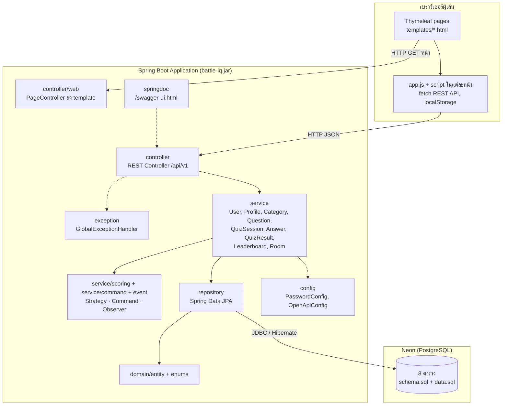
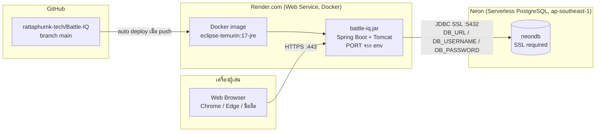

# Component Diagram

| Component | หน้าที่ | ขึ้นกับ |
|---|---|---|
| Thymeleaf pages | หน้าเว็บ 13 หน้า โครงร่างจาก `fragments/layout.html` | app.js |
| app.js | เรียก API, เก็บสถานะ login, เมนูผู้ใช้ | REST API |
| REST Controller | รับ-ส่ง DTO ตรวจ `@Valid` | Service |
| GlobalExceptionHandler | แปลง exception เป็น `ErrorResponseDTO` รูปแบบเดียว | — |
| Service | business logic และ transaction | Repository, Pattern components |
| Strategy / Command / Observer | คิดคะแนน, ส่งคำตอบ, อัปเดตโปรไฟล์หลังจบเกม | Service, Domain |
| Repository | เข้าถึงฐานข้อมูล | Domain, PostgreSQL |
| Config | BCrypt `PasswordEncoder`, ข้อมูล OpenAPI | — |

---

# Deployment Diagram

| Node | รายละเอียด |
|---|---|
| เครื่องผู้เล่น | เบราว์เซอร์ใดก็ได้ ไม่ต้องติดตั้ง สถานะ login เก็บใน localStorage |
| Render Web Service | build จาก `Dockerfile` ที่ราก repo (multi-stage: build ด้วย JDK 17 แล้วรันด้วย JRE 17) อ่านพอร์ตจากตัวแปร `PORT` ตัวแปรฐานข้อมูลตั้งในหน้า Environment ของ Render แผนฟรีจะหลับเมื่อไม่มีการใช้งาน |
| Neon | PostgreSQL แบบ serverless ทีมใช้ฐานเดียวกันทั้ง dev และ production ตารางถูกสร้างอัตโนมัติจาก `schema.sql` / Hibernate |
| GitHub | เก็บโค้ด Render ดึงจาก `main` เมื่อมีการ push |

การรันในเครื่องนักพัฒนาใช้โครงเดียวกัน แต่แทน Render ด้วย `./mvnw spring-boot:run` หรือ `docker compose up` และอ่านค่าฐานข้อมูลจากไฟล์ `.env`
