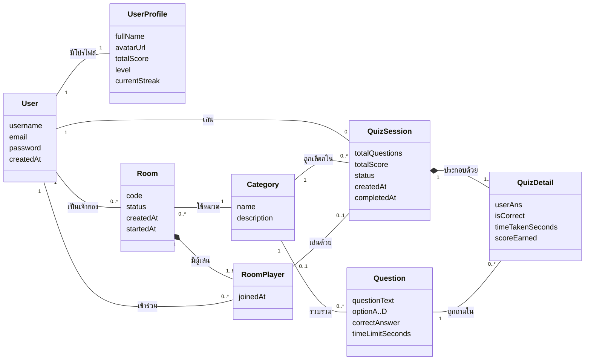

# Domain Model (Conceptual Class Diagram)

แสดงแนวคิดหลักของระบบและความสัมพันธ์ ไม่ลงรายละเอียดระดับฐานข้อมูล (ดู ER Diagram สำหรับตารางจริง)

## คำอธิบายแนวคิด

| แนวคิด | ความหมาย | กฎสำคัญ |
|---|---|---|
| **User** | บัญชีผู้ใช้สำหรับเข้าสู่ระบบ | ชื่อผู้ใช้และอีเมลไม่ซ้ำ รหัสผ่านเก็บแบบ BCrypt |
| **UserProfile** | ข้อมูลเกมของผู้ใช้ 1 คน | สร้างพร้อม User, level = totalScore / 100 + 1, streak +1 เมื่อรอบได้คะแนน และกลับเป็น 0 เมื่อได้ 0 |
| **Category** | หมวดหมู่ของคำถาม | ชื่อไม่ซ้ำ ลบไม่ได้ถ้ามีรอบการเล่นอ้างถึง |
| **Question** | คำถาม 4 ตัวเลือก | เฉลยเป็น A–D เวลา 5–120 วินาที |
| **QuizSession** | การเล่น 1 รอบของผู้ใช้ 1 คนในหมวดหนึ่ง | สถานะ IN_PROGRESS → COMPLETED จบซ้ำไม่ได้ totalScore รวมจาก QuizDetail ฝั่ง server |
| **QuizDetail** | คำถาม 1 ข้อในรอบนั้นและคำตอบของผู้เล่น | ตอบได้ครั้งเดียว คะแนนคิดจาก ScoringStrategy |
| **Room** | ห้องแข่งหลายคน | รหัส 6 ตัวไม่ซ้ำ สถานะ WAITING → IN_PROGRESS → FINISHED เริ่มได้เมื่อมี ≥ 2 คน |
| **RoomPlayer** | ผู้เล่น 1 คนในห้อง 1 ห้อง (ตารางกลาง Many-to-Many) | 1 คนเข้าห้องเดียวกันได้ครั้งเดียว ได้ QuizSession ของตัวเองเมื่อห้องเริ่ม โดยทุกคนได้คำถามชุดเดียวกัน |

## เหตุการณ์สำคัญ

- **เริ่มเกม:** QuestionFactory สุ่ม Question จาก Category → สร้าง QuizSession พร้อม QuizDetail ว่าง
- **ตอบคำถาม:** SubmitAnswerCommand ตรวจคำตอบ เลือก ScoringStrategy ตาม streak และเวลาจำกัด บันทึกลง QuizDetail
- **จบเกม:** รวมคะแนน → ส่ง GameCompletedEvent → UserProfile อัปเดตคะแนนรวม เลเวล streak
- **ห้องแข่ง:** เจ้าของกดเริ่ม → สุ่มคำถาม 1 ชุด → สร้าง QuizSession ให้ RoomPlayer ทุกคน → เมื่อทุก session เป็น COMPLETED ห้องเป็น FINISHED
