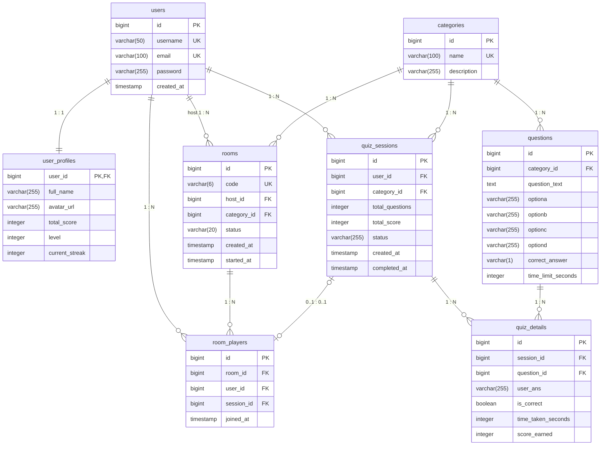

# ER Diagram

ตารางจริงในฐานข้อมูล PostgreSQL ตาม `schema.sql` (Hibernate สร้างแบบเดียวกันจาก entity)

## ความสัมพันธ์

| ความสัมพันธ์ | ชนิด | วิธี map ใน JPA | Cascade / Fetch |
|---|---|---|---|
| users – user_profiles | One-to-One | `User.profile` (`mappedBy`), `UserProfile.user` + `@MapsId` ใช้ `user_id` เป็น PK | `CascadeType.ALL` จาก User, `LAZY` ทั้งสองฝั่ง |
| categories → questions | One-to-Many | `Category.questions` (`mappedBy`), `Question.category` | `CascadeType.ALL`, `orphanRemoval`, `LAZY` |
| users → quiz_sessions | One-to-Many | `QuizSession.user` | `LAZY` |
| categories → quiz_sessions | One-to-Many | `QuizSession.category` | `LAZY` |
| quiz_sessions → quiz_details | One-to-Many | `QuizSession.details` (`mappedBy`), `QuizDetail.quizSession` | `CascadeType.ALL`, `orphanRemoval`, `LAZY` |
| questions → quiz_details | One-to-Many | `QuizDetail.question` | `LAZY` |
| users ↔ rooms | Many-to-Many ผ่าน room_players | `Room.players` (`mappedBy`), `RoomPlayer.room`, `RoomPlayer.user` | `CascadeType.ALL` จาก Room, unique (`room_id`, `user_id`) |
| users → rooms (host) | One-to-Many | `Room.host` | `LAZY` |
| room_players – quiz_sessions | One-to-One (nullable) | `RoomPlayer.quizSession` | `LAZY`, ว่างจนกว่าห้องจะเริ่ม |

เหตุผลเรื่อง fetch: ทุก `@ManyToOne` และ `@OneToOne` เป็น `LAZY` เพื่อไม่ให้ดึง entity ข้างเคียงมาโดยไม่จำเป็น service ที่ต้องใช้จะเรียกภายใน `@Transactional` ส่วน cascade ใช้เฉพาะความสัมพันธ์แบบ "เป็นเจ้าของ" (session เป็นเจ้าของ detail, room เป็นเจ้าของ player) ไม่ cascade ไปยัง user หรือ category ที่มีชีวิตของตัวเอง

## Index

| Index | ตาราง (คอลัมน์) | ใช้โดย |
|---|---|---|
| `idx_questions_category` | questions (category_id) | สุ่มคำถามตามหมวด, ดึงคำถามของหมวด |
| `idx_quiz_sessions_user` | quiz_sessions (user_id) | ประวัติการเล่น |
| `idx_quiz_details_session` | quiz_details (session_id) | ดึงคำตอบของรอบ, รวมคะแนน |
| `idx_quiz_details_question` | quiz_details (question_id) | ตรวจว่าคำถามถูกใช้แล้วก่อนลบ |
| `idx_user_profiles_total_score` | user_profiles (total_score DESC) | leaderboard |
| `idx_room_players_room` | room_players (room_id) | รายชื่อผู้เล่นในห้อง (polling ทุก 2 วินาที) |
| unique `users.username`, `users.email`, `categories.name`, `rooms.code` | — | กันข้อมูลซ้ำและใช้ค้นหา |

Data Dictionary อยู่ที่ [../data-dictionary.md](../data-dictionary.md)
