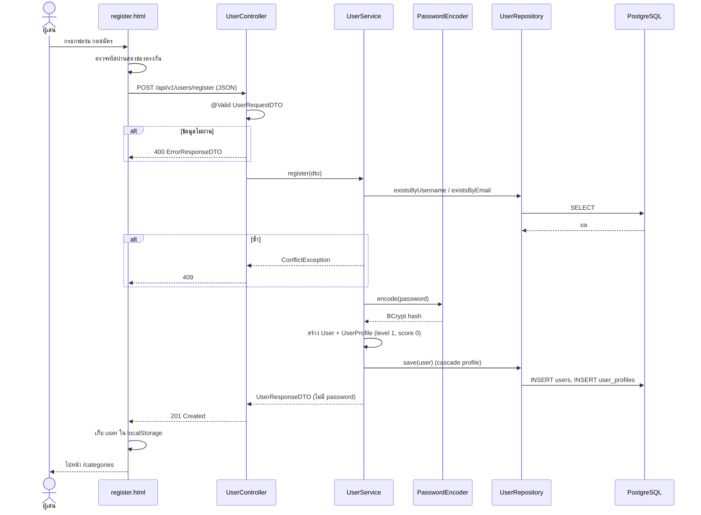
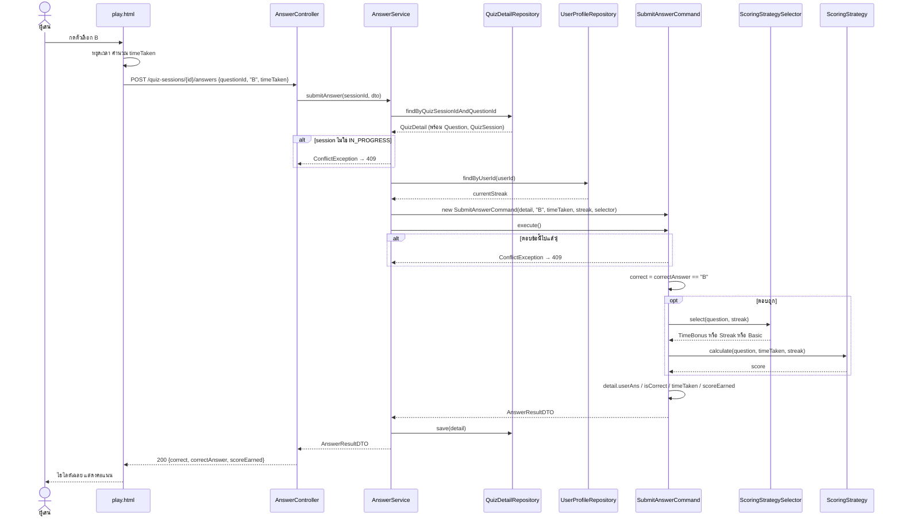
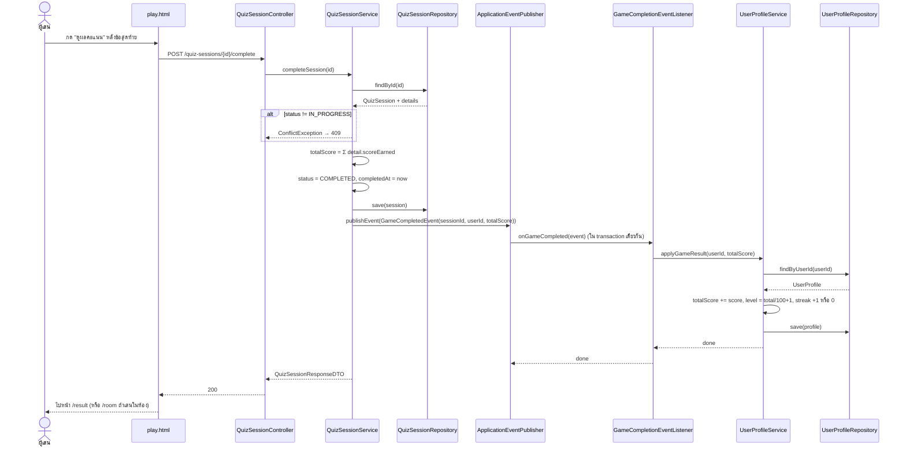
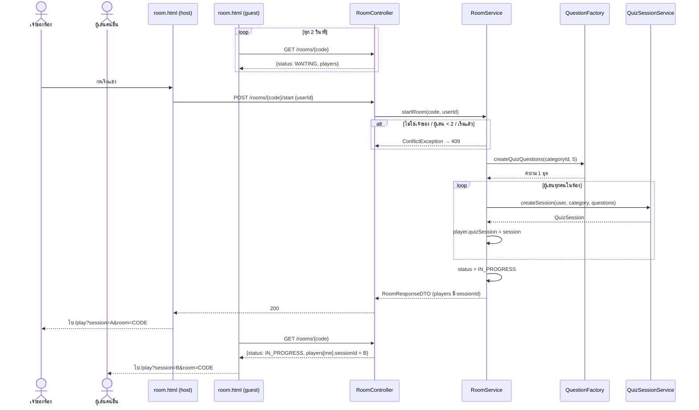

# Sequence Diagrams

3 scenario หลัก: สมัครสมาชิก, ตอบคำถาม 1 ข้อ (Command + Strategy), จบเกม (Observer) และเพิ่มการเริ่มแข่งในห้อง

## 1. สมัครสมาชิก

## 2. ตอบคำถาม 1 ข้อ (Command + Strategy)

## 3. จบเกมและอัปเดตโปรไฟล์ (Observer)

## 4. เริ่มแข่งในห้อง (เพิ่มเติม)

