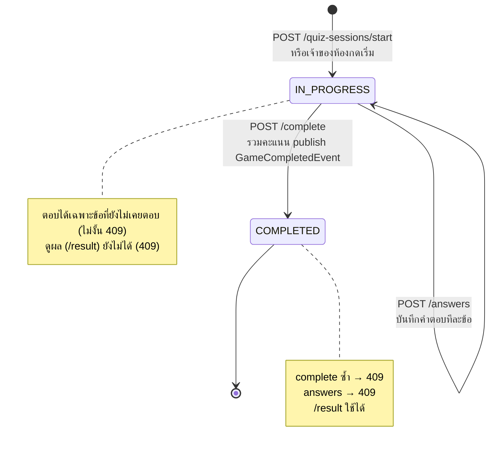
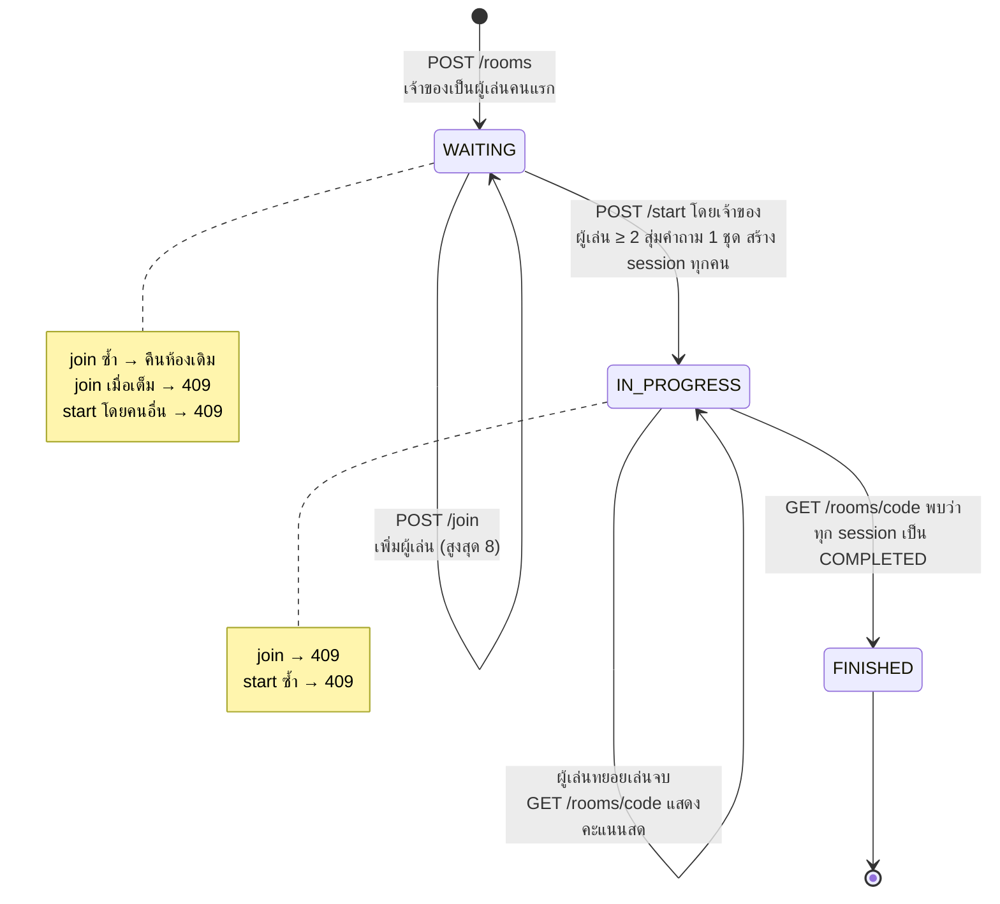

# State Diagram

Entity ที่มีสถานะคือ `QuizSession` และ `Room`

## QuizSession

สถานะ `ABANDONED` มีใน enum `SessionStatus` ไว้สำหรับรอบที่ผู้เล่นออกกลางคัน แต่เวอร์ชันนี้ยังไม่มี endpoint ที่เปลี่ยนเป็นสถานะนี้ รอบที่ค้างจะอยู่ที่ IN_PROGRESS และกด "เล่นต่อ" ได้จากหน้าประวัติ

## Room

การเปลี่ยนเป็น FINISHED เกิดตอนมีคนเรียก `GET /rooms/{code}` (หน้าห้อง polling ทุก 2 วินาที) ไม่มี scheduler แยก ถ้าไม่มีใครเปิดหน้าห้อง สถานะจะค้างที่ IN_PROGRESS จนกว่าจะมีคนเปิด
