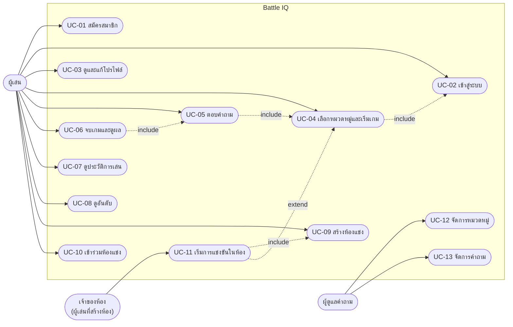

# Use Case Diagram

เจ้าของห้องคือผู้เล่นคนหนึ่งที่สร้างห้อง จึงทำ UC-01 ถึง UC-10 ได้ทั้งหมดและเพิ่ม UC-11 ส่วนผู้ดูแลคำถามในเวอร์ชันนี้ยังไม่มีระบบสิทธิ์แยก ผู้ใช้ทุกคนเข้าหน้าจัดการได้

## Use Case Description

### UC-01 สมัครสมาชิก

| หัวข้อ | รายละเอียด |
|---|---|
| Actor | ผู้เล่น |
| Precondition | ยังไม่มีบัญชี |
| Main flow | 1. เปิดหน้า `/register` 2. กรอกชื่อผู้ใช้ อีเมล รหัสผ่าน ยืนยันรหัสผ่าน ชื่อที่แสดง 3. ระบบตรวจรูปแบบ (ชื่อ 3–50 ตัว a-z 0-9 _, รหัสผ่าน 6–72 ตัว) 4. ระบบตรวจชื่อและอีเมลซ้ำ 5. เข้ารหัสรหัสผ่านด้วย BCrypt บันทึก `users` และสร้าง `user_profiles` (level 1 คะแนน 0) 6. พาไปหน้าเลือกหมวดหมู่ |
| Alternative | 3a. ข้อมูลไม่ผ่าน → 400 แสดงข้อความใต้ฟอร์ม / 4a. ชื่อหรืออีเมลซ้ำ → 409 |
| Postcondition | มีบัญชีและโปรไฟล์ สถานะ login ถูกเก็บในเบราว์เซอร์ |
| API | `POST /api/v1/users/register` |

### UC-02 เข้าสู่ระบบ

| หัวข้อ | รายละเอียด |
|---|---|
| Actor | ผู้เล่น |
| Precondition | มีบัญชี |
| Main flow | 1. กรอกชื่อผู้ใช้และรหัสผ่าน 2. ระบบเทียบรหัสผ่านกับค่า BCrypt 3. คืนข้อมูลผู้ใช้และโปรไฟล์ |
| Alternative | 2a. ไม่พบผู้ใช้หรือรหัสผิด → 401 ข้อความเดียวกัน ไม่บอกว่าผิดช่องไหน |
| API | `POST /api/v1/users/login` |

### UC-03 ดูและแก้โปรไฟล์

| หัวข้อ | รายละเอียด |
|---|---|
| Actor | ผู้เล่น |
| Precondition | login แล้ว |
| Main flow | 1. เปิด `/profile` เห็นคะแนนรวม เลเวล streak 2. แก้ชื่อที่แสดงหรือลิงก์รูป 3. บันทึก |
| Alternative | 2a. ชื่อเกิน 100 หรือลิงก์เกิน 255 → 400 |
| API | `GET` / `PUT /api/v1/profiles/user/{userId}` |

### UC-04 เลือกหมวดหมู่และเริ่มเกม

| หัวข้อ | รายละเอียด |
|---|---|
| Actor | ผู้เล่น |
| Precondition | login แล้ว หมวดหมู่มีคำถามอย่างน้อย 1 ข้อ |
| Main flow | 1. เปิด `/categories` 2. กดเริ่มเล่นที่หมวดหมู่ 3. ระบบสุ่มคำถามสูงสุด 5 ข้อผ่าน `QuestionFactory` 4. สร้าง `quiz_sessions` สถานะ IN_PROGRESS และ `quiz_details` ข้อละ 1 แถว 5. พาไปหน้าเล่นเกม |
| Alternative | 3a. หมวดไม่มีคำถาม → 404 |
| API | `POST /api/v1/quiz-sessions/start`, `GET /api/v1/quiz-sessions/{id}/questions` |

### UC-05 ตอบคำถาม

| หัวข้อ | รายละเอียด |
|---|---|
| Actor | ผู้เล่น |
| Precondition | มีรอบที่กำลังเล่น |
| Main flow | 1. หน้าเล่นเกมแสดงคำถามพร้อมนับถอยหลัง 2. ผู้เล่นกดตัวเลือก A–D 3. `SubmitAnswerCommand` ตรวจถูกผิด เลือกสูตรคะแนนจาก `ScoringStrategySelector` คิดคะแนน บันทึกลง `quiz_details` 4. แสดงเฉลยและคะแนนที่ได้ 5. ไปข้อถัดไป |
| Alternative | 2a. หมดเวลา → ข้อนั้นได้ 0 ไม่ส่งคำตอบ / 3a. ตอบข้อเดิมซ้ำหรือรอบจบแล้ว → 409 |
| API | `POST /api/v1/quiz-sessions/{id}/answers` |

### UC-06 จบเกมและดูผล

| หัวข้อ | รายละเอียด |
|---|---|
| Actor | ผู้เล่น |
| Main flow | 1. ตอบครบทุกข้อ กด "ดูผลคะแนน" 2. ระบบรวม `score_earned` ทุกข้อเป็น `total_score` เปลี่ยนสถานะเป็น COMPLETED 3. ส่ง `GameCompletedEvent` 4. `GameCompletionEventListener` อัปเดตโปรไฟล์: คะแนนรวม เลเวล (ทุก 100 คะแนน) streak (+1 ถ้าได้คะแนน, 0 ถ้าไม่ได้) 5. แสดงหน้าสรุปผลพร้อมเฉลยทุกข้อ |
| Alternative | 2a. จบซ้ำ → 409 |
| API | `POST /api/v1/quiz-sessions/{id}/complete`, `GET /api/v1/quiz-sessions/{id}/result` |

### UC-07 ดูประวัติการเล่น

| หัวข้อ | รายละเอียด |
|---|---|
| Actor | ผู้เล่น |
| Main flow | เปิด `/history` เห็นทุกรอบเรียงจากใหม่ไปเก่า กด "ดูผล" ไปหน้าสรุปผล หรือ "เล่นต่อ" ถ้ายังไม่จบ |
| API | `GET /api/v1/users/{userId}/quiz-sessions` |

### UC-08 ดูอันดับ

| หัวข้อ | รายละเอียด |
|---|---|
| Actor | ผู้เล่น (ไม่ต้อง login) |
| Main flow | เปิด `/leaderboard` เห็นผู้เล่นเรียงตามคะแนนรวม แบ่งหน้าละ 10 |
| API | `GET /api/v1/leaderboard?page=&size=` |

### UC-09 สร้างห้องแข่ง

| หัวข้อ | รายละเอียด |
|---|---|
| Actor | ผู้เล่น |
| Main flow | 1. เปิด `/rooms` เลือกหมวดหมู่ กดสร้างห้อง 2. ระบบสร้างรหัส 6 ตัวที่ไม่ซ้ำ บันทึก `rooms` สถานะ WAITING และเพิ่มผู้สร้างเป็นผู้เล่นคนแรก 3. แสดงหน้าห้องพร้อมรหัสให้ส่งต่อ |
| Postcondition | ผู้สร้างเป็นเจ้าของห้อง |
| API | `POST /api/v1/rooms` |

### UC-10 เข้าร่วมห้องแข่ง

| หัวข้อ | รายละเอียด |
|---|---|
| Actor | ผู้เล่น |
| Precondition | มีรหัสห้อง ห้องยังอยู่ในสถานะ WAITING |
| Main flow | 1. ใส่รหัสห้อง 2. ระบบเพิ่มลง `room_players` 3. หน้าห้องแสดงรายชื่อผู้เล่น อัปเดตทุก 2 วินาที |
| Alternative | 2a. ห้องเริ่มแล้ว → 409 / 2b. ห้องเต็ม (8 คน) → 409 / 2c. อยู่ในห้องแล้ว → คืนข้อมูลห้องเดิม |
| API | `POST /api/v1/rooms/{code}/join`, `GET /api/v1/rooms/{code}` |

### UC-11 เริ่มการแข่งขันในห้อง

| หัวข้อ | รายละเอียด |
|---|---|
| Actor | เจ้าของห้อง |
| Precondition | ห้องมีผู้เล่นอย่างน้อย 2 คน |
| Main flow | 1. เจ้าของห้องกดเริ่มแข่ง 2. ระบบสุ่มคำถาม 1 ชุด แล้วสร้าง `quiz_sessions` ให้ผู้เล่นทุกคนด้วยคำถามชุดเดียวกัน 3. ห้องเปลี่ยนเป็น IN_PROGRESS 4. ทุกเครื่องถูกพาไปหน้าเล่นเกมของตัวเอง 5. เมื่อทุกคนจบ ห้องเป็น FINISHED แสดงอันดับ |
| Alternative | 1a. ไม่ใช่เจ้าของห้อง → 409 / 1b. ผู้เล่นไม่ถึง 2 → 409 |
| API | `POST /api/v1/rooms/{code}/start` |

### UC-12 จัดการหมวดหมู่

| หัวข้อ | รายละเอียด |
|---|---|
| Actor | ผู้ดูแลคำถาม |
| Main flow | เปิด `/admin/categories` เพิ่ม แก้ไข ลบหมวดหมู่ |
| Alternative | ชื่อซ้ำ → 409 / ลบหมวดที่มีรอบการเล่นอ้างถึง → 409 |
| API | `POST` / `PUT` / `DELETE /api/v1/categories` |

### UC-13 จัดการคำถาม

| หัวข้อ | รายละเอียด |
|---|---|
| Actor | ผู้ดูแลคำถาม |
| Main flow | เปิด `/admin/questions` ดูคำถามแบบแบ่งหน้า เพิ่ม แก้ไข ลบ |
| Alternative | เฉลยไม่ใช่ A–D หรือเวลาไม่อยู่ใน 5–120 วินาที → 400 / ลบคำถามที่เคยถูกใช้ → 409 |
| API | `GET` / `POST` / `PUT` / `DELETE /api/v1/questions` |
